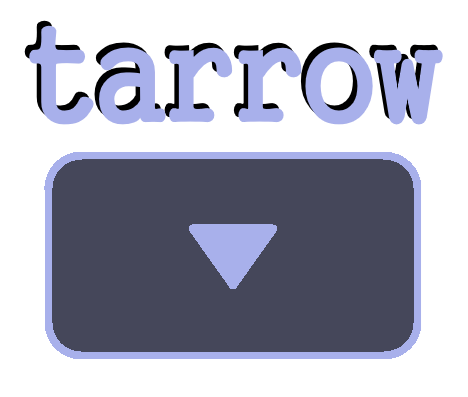
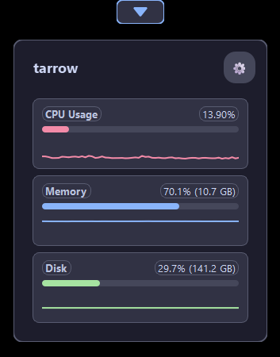
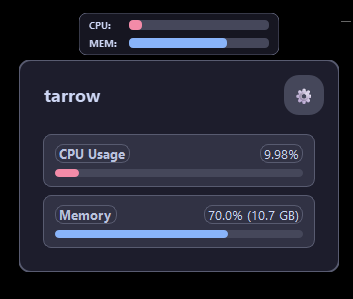

  

  <strong>a sleek, very lightweight, and customizable system stats overlay for your desktop.</strong>

---

  
  

---

### whar?

tarrow is a tiny arrow on your screen edge that shows live system stats. minimal, not resource heavy, and out of the way.

### features

*   two views: edge arrow or movable compact HUD that you can place anywhere.
*   overlay: hover over the arrow or hud to see everything including usage, temps, top processes, graphs
*   customizable: you can toggle stas visibility, switch views, set opacity and update speed.
*   global hotkey: set a "peek" hotkey.
*   drag & drop: move it where you want with right click. it'll save the position if you close it in your home directory.
*   resource alerts: the edge arrow will pulse red if your cpu or memory usage gets too high. good for shitboxes!

### run ts
you know the drill

1. get python. tested on 3.11.9.

2. pip install whatever the hell (requirements.txt)

3. run main.py

### how to use

*   **see details**: just hover your mouse over the edge arrow or the compact hud.
*   **move it**: right-click and drag the arrow or hud to a new spot.
*   **pin the overlay**: left-click the edge arrow to pin the detailed overlay so it stays open. click again to unpin. (this only works in arrow mode).
*   **peek with a key**: press and hold your global hotkey, release to hide.
*   **change settings**: hover to show the detailed overlay, then click the little gear icon (⚙️) in the top-right corner.

### boring stuff
pin icon: [here](https://indonesian-recipes.com/download/2030-version.html) (changed to be one color)

### todo
none for now :D